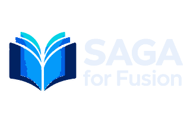

  

# SAGA App Support

Official support and policy repository for **SAGA — Shawn’s Assembly Guide Authoring for Autodesk Fusion**.

SAGA helps makers, independent product designers, and small hardware developers create illustrated assembly guides from Autodesk Fusion viewport captures while keeping project and publication files local.

**Public support site:** [SAGA Support on GitHub Pages](https://ejronin.github.io/SAGA-App-Support/)

## Documentation

- [Quick Start](quick-start.md)
- [User Guide](user-guide.md)
- [Troubleshooting](troubleshooting.md)
- [Frequently Asked Questions](faq.md)
- [Support Policy](support.md)
- [Privacy Policy](privacy.md)
- [Refund Policy](refunds.md)
- [Licensing](licensing.md)
- [Release and Update Policy](updates.md)
- [Release Notes](release-notes.md)

## Support

Email **sagaappsupport@gmail.com**.

Support is provided by email only, Monday through Friday, 10:00 a.m. to 5:00 p.m. Eastern Time, excluding holidays. The target initial response time is two business days.

## Repository scope

This public repository contains support and policy documents only. It does not contain the SAGA application source code, Autodesk Marketplace package, entitlement implementation, internal release records, customer projects, credentials, payment information, or private development material.

SAGA is published by Shawn Gordon. SAGA is not an Autodesk product and is not endorsed, sponsored, or warranted by Autodesk.

Copyright © 2026 Shawn Gordon. All rights reserved.
