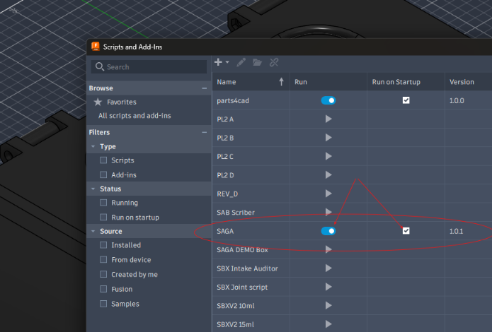

This walkthrough takes you from first launch to a finished PDF. For expanded workflow detail, continue with the [User Guide](user-guide.md).

<strong>Release status:</strong> SAGA 1.0 is currently in Autodesk Design and Make Marketplace review and release qualification. These steps describe the intended Marketplace release workflow; public Marketplace availability has not yet been confirmed.

<strong>Before you begin:</strong> open the Fusion design you want to document and sign in to Fusion with the same Autodesk account used for the SAGA trial or purchase.

## 1. Install and start SAGA

Install SAGA through the Autodesk Design and Make Marketplace. Close Fusion before installing, updating, or removing the add-in.

In Fusion:

1. Open **Utilities > Scripts and Add-Ins**.
2. Open the **Add-Ins** list and select **SAGA**.
3. Turn **Run** on to start SAGA for the current Fusion session.
4. Enable **Run on Startup** if you want Fusion to start SAGA automatically later.

<figure class="guide-shot guide-shot--wide">
  
  <figcaption>Start SAGA from Fusion's Scripts and Add-Ins window.</figcaption>
</figure>

Once SAGA is running, use Fusion's **Add-Ins** menu to open or reopen the SAGA palette.

## 2. Confirm Marketplace access

SAGA uses Autodesk Marketplace entitlement verification for both the Free 30-Day Trial and purchased access.

- **Access active** means the signed-in Autodesk account can use SAGA.
- **Access required** means Autodesk is not currently reporting valid access for that account.

If access is required, start the Marketplace trial or purchase SAGA using the same Autodesk account, return to Fusion, and select **Check again**. SAGA does not run a separate local trial clock.

## 3. Create or open a project

On **Project**:

1. Enter the product name, product revision, manual revision, manual title, and author.
2. Choose the parent folder for the new project.
3. Select **New Project**.
4. Add a logo and finished-product image when useful.
5. Review the capture settings before you begin capturing steps.

Use **Open** instead when you want to continue an existing SAGA project.

SAGA keeps the editable project, captures, imported BOM files, cover assets, and generated PDFs together in the local project folder.

## 4. Add parts, hardware, tools, and consumables

Open **Parts** to add catalog items manually or import a CSV/XLSX bill of materials. A part number is optional unless the assembly depends on an exact component.

The import source needs a recognized name column such as `Name`, `Item Name`, or `Part Name`.

[Download the SAGA BOM import template](assets/SAGA-BOM-Import-Template.csv).

## 5. Create the first step and capture the view

1. Open **Steps** and select **+ New Step**.
2. On **Details**, enter a short step title.
3. Assign any parts, hardware, tools, or consumables needed for the step.
4. Open **Image**.
5. Arrange the Fusion viewport so it shows the assembly state you want the reader to see.
6. Select **Capture View**. SAGA captures the current Fusion view and opens **Markup**.

## 6. Add the instruction and markup

On **Markup**, write the step instruction and add any notices or visual guidance that help explain the operation. SAGA provides arrows, leaders, alignment lines, labels, visual markers, and BOM-linked part callouts.

When the instruction and markup are ready, select **Apply Markup to Step**. Then save the project from the **Project** tab.

<strong>Before leaving Markup:</strong> if SAGA asks what to do with unapplied changes, choose <strong>Apply and Continue</strong> when you want to keep the current work. <strong>Discard Changes</strong> can move the active step image to the project's trash, which means you may need to recapture before markup can continue. See <a href="{{ '/user-guide.html#leaving-markup-with-unapplied-changes' | relative_url }}">Leaving Markup with unapplied changes</a> for the exact behavior and recovery steps.

## 7. Check the project

Open **Check Project** and run the check.

- Fix every error before publication.
- Review warnings; warnings do not block PDF generation.

## 8. Generate the PDF

1. Open **PDF**.
2. Choose **US Letter** or **A4**.
3. Choose **Portrait** or **Landscape**.
4. Choose whether to include the **Cover page**, **Contents and links**, and **Bill of materials**.
5. Select **Generate PDF**.

SAGA writes the complete PDF directly into the project folder. The demonstration guide and listing screenshots are part of the Marketplace submission materials. Public downloads will be added after Marketplace review is complete.

## Help while you work

Select **Help** in the SAGA palette or press **F1** while the palette has keyboard focus. Fusion routes F1 to the active pane, so SAGA help will not open while the Fusion canvas has focus.

Continue with the [User Guide](user-guide.md) for more detail on capture settings, BOM allocation, notices, configuration paths, validation, Marketplace access, logs, and support.
