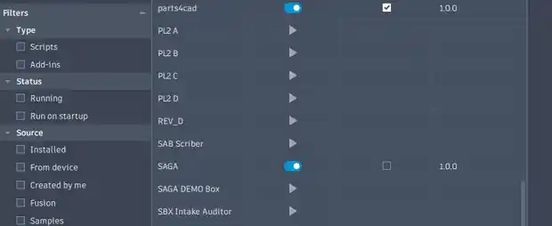

# SAGA User Guide

SAGA — Shawn's Assembly Guide Authoring — is a Fusion add-in for building illustrated assembly guides from the model and view already open in Autodesk Fusion. A SAGA project stays editable and is stored in a normal local folder. When the guide is ready, SAGA creates one linked PDF in that project folder.

This guide covers the complete SAGA 1.0 workflow. For a faster introduction, start with the [Quick Start](quick-start.md).

## Start SAGA

SAGA is installed through the Autodesk Design and Make Marketplace. Close Fusion before installing, updating, or removing it.

SAGA does not start automatically by default. In Fusion:

1. Open **Utilities > Scripts and Add-Ins**.
2. Select **Add-Ins**.
3. Select **SAGA** and run it.
4. Use the SAGA command in Fusion's **Scripts and Add-Ins** panel whenever you need to reopen the palette.

Fusion allows users to enable automatic startup later. Leaving it disabled keeps SAGA out of Fusion's normal startup path until it is needed.

## Projects and local storage

A SAGA project is a folder containing the editable project record, captured images, optional cover assets, imported BOM sources, and generated output. Keep the project folder together when moving, backing up, or archiving a guide.

SAGA does not upload the Fusion model or project content to a SAGA server. Project files remain in the location selected by the user.

### Create a project

On **Project**:

1. Enter the product name.
2. Enter the product and manual revisions.
3. Enter the manual title and author.
4. Choose the parent folder for new projects.
5. Select **New Project**.

The product revision identifies the physical design. The manual revision identifies the instruction document. They may change independently.

### Open and save

Use **Open** to select an existing SAGA project folder. Use **Save** after meaningful work and before closing Fusion.

Generating a PDF does not lock the project. The project remains editable, and a later successful publication replaces the prior PDF with the current version.

## Project setup

### Cover assets

A project may include:

- One project or company logo
- One finished-product image for the cover

SAGA copies selected images into the project's `assets` folder. The project does not depend on the original file location after the copy is complete.

### Capture settings

Capture settings apply to new Fusion viewport captures:

- Width and height
- Delay before capture
- Anti-aliasing
- Transparent background

The default 2560 × 1440 capture is suitable for most manuals. Higher resolutions increase project size and PDF-generation time.

When **Transparent background** is enabled, SAGA asks Fusion for an alpha-capable PNG and verifies that the result supports transparency. The setting is saved with the project and may be changed later. Existing captures do not change automatically; recapture a step when a different background treatment is required.

## Parts, hardware, tools, and consumables

The **Parts** tab is a practical item catalog and BOM. It is not limited to manufactured parts. Use it for anything the reader needs, including:

- Printed or fabricated parts
- Purchased hardware
- Tools
- Adhesives, lubricant, and other consumables

A clear item name is the only essential identifier. Part number, supplier, description, notes, marker type, and fixed project quantity are optional.

### Add an item manually

1. Open **Parts**.
2. Select **Add Item**.
3. Choose the category.
4. Enter the name and unit.
5. Add a part number or fixed total quantity when the assembly requires it.
6. Choose a default visual marker when useful.
7. Save the item.

### Import a BOM

SAGA imports CSV and XLSX sources and copies the imported file into the project. The source must contain a recognized name column, such as `Name`, `Item Name`, or `Part Name`.

The import may also use columns for category, quantity, unit, part number, description, supplier, notes, and visual marker. Review imported items before assigning them to steps.

### Quantity behavior

A fixed project quantity enables allocation checks. Step assignments and BOM-linked callouts may either:

- **Install or use quantity** — counts against the planned total
- **Reference only** — identifies an item without consuming additional quantity

Use reference-only callouts when the same installed item must be identified again later or along an alternate configuration path.

## Steps

Open **Steps** and select **New Step**. Each step has three work areas: **Details**, **Image**, and **Markup**.

### Step sequence and details

Give each step a short operation title, such as “Install the hinge rod” rather than “Step 2.” Add the instruction in direct, actionable language.

A step can also contain:

- Parts, hardware, tools, and consumables used at that step
- Information, caution, warning, do-not, inspect, and check notices
- An optional printed step number for linear projects
- A configuration split point

### Capture the Fusion view

Before selecting **Capture View**:

1. Set the model position and camera in Fusion.
2. Show or hide components as needed.
3. Choose the visual style and background treatment.
4. Confirm the active step.
5. Capture the view.

Replacing a capture moves the previous source image to the project's trash folder and clears markup tied to that old image.

### Markup tools

SAGA markup remains editable after the project is saved. Available tools include:

- Arrow
- Leader or alignment line
- Text label
- BOM-linked part callout
- Visual marker

Use markup only where it improves understanding. The Fusion capture should remain the main source of visual information.

### BOM-linked part callouts

A part callout can pull its label and marker from the project catalog. Set the quantity shown and choose whether the callout installs or uses that quantity, or is reference-only.

Select **Apply Markup to Step** after changing image markup. SAGA retains both the editable markup records and the rendered image used in the PDF. Save the project before closing Fusion.

When leaving Markup with unapplied changes, SAGA offers:

- **Apply and Continue**
- **Discard Changes**
- **Cancel**

Discard returns to the last applied markup. It does not delete the original Fusion capture.

## Configuration paths

Configurations are optional. Use them when the guide has:

- A shared opening sequence
- One set of alternative assembly paths
- An optional shared finish

SAGA 1.0 supports one split and up to five paths. Nested splits are not supported.

To create a split:

1. Select the last shared step before the alternatives begin.
2. Choose **Create Split Here**.
3. Name the first two paths.
4. Add more paths when needed.
5. Select a path while creating its branch steps.

SAGA calculates path-specific printed step numbers and adds links to the PDF so readers can move from the shared sequence to the appropriate branch.

## Check Project

Open **Check Project** before publication.

- **Errors** must be corrected before PDF generation.
- **Warnings** should be reviewed but do not block publication.

Checks cover required project information, step images and instructions, configuration consistency, BOM allocation, assets, and publication readiness. A step-related result opens the affected step.

## Create the PDF

On **PDF**:

1. Choose the page size and orientation.
2. Choose whether to include the cover page.
3. Choose whether to include contents and links.
4. Choose whether to include the bill of materials.
5. Select **Generate PDF**.

SAGA creates one complete PDF directly in the project folder. The PDF may contain the cover, linked contents, bookmarks, configuration links, step notices, marked-up images, step-specific item lists, and total BOM.

Large, high-resolution guides may take about a minute to compile. If Windows reports that the output is in use, close the PDF in its viewer and generate it again.

### Sample output

The approved demonstration guide shows transparent captures, notices, a BOM-linked callout, a configuration branch, and a total BOM. A preview is available on the [SAGA Support home page](index.md); the complete sample is also used in the Autodesk Marketplace listing.

## Trial and purchased access

SAGA includes a seven-day, fully functional evaluation period. Evaluation output is not watermarked, and customer branding remains available.

After the evaluation expires, continued authoring and publication require a valid Autodesk Marketplace entitlement. Existing projects and PDFs are not deleted or altered.

SAGA checks purchased entitlement through Autodesk. A recently confirmed purchase may continue offline for a limited grace period. Project content is not included in the entitlement request.

## Logs and support

SAGA writes local diagnostic logs under the current user's local application-data area. When requesting support, include:

- SAGA version
- Fusion version
- Windows version
- The exact error message
- Steps that reproduce the issue
- A screenshot or local SAGA log when useful

Remove confidential project information before sending logs or screenshots unless it is necessary to diagnose the issue.

Support: **sagaappsupport@gmail.com**

See the [Support Policy](support.md), [Privacy Policy](privacy.md), and [Troubleshooting](troubleshooting.md) pages for more information.
