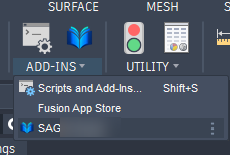
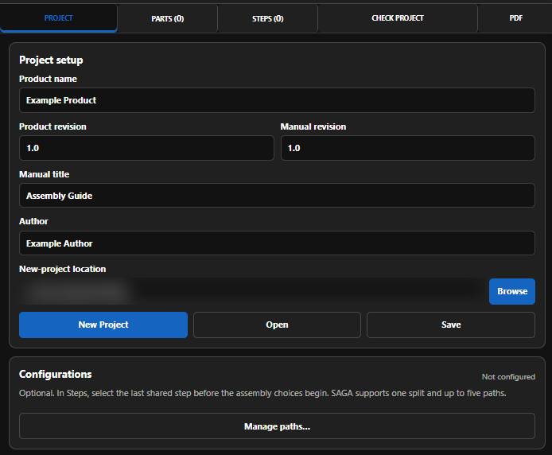
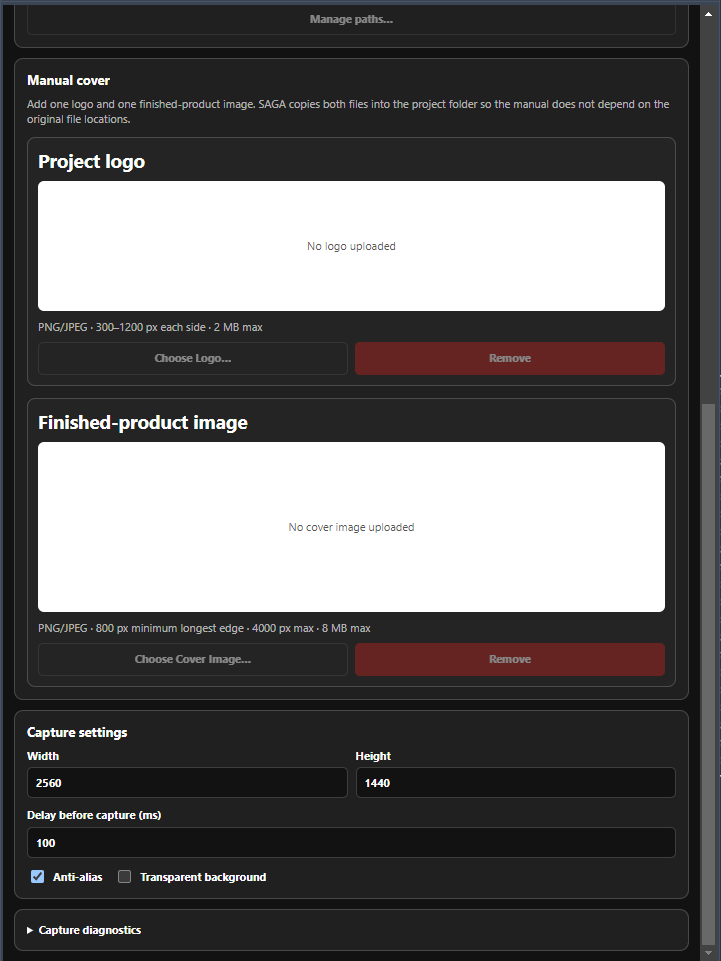

SAGA — Shawn's Assembly Guide Authoring — is an Autodesk Fusion add-in for creating illustrated assembly guides from the model and view already open in Fusion. SAGA 1.0 is currently in Autodesk Design and Make Marketplace review and release qualification. Projects remain editable in normal local folders, and SAGA creates one complete PDF in the project folder when the guide is ready.

For a shorter first-use walkthrough, start with the [Quick Start](quick-start.md). Use [Troubleshooting](troubleshooting.md) when something appears broken, access is not recognized, or publication fails.

<div class="page-toc">
<strong>In this guide</strong>
<ul>
  <li><a href="#access-installation-and-startup">Access, installation, and startup</a></li>
  <li><a href="#projects-and-local-storage">Projects and local storage</a></li>
  <li><a href="#project-settings">Project settings</a></li>
  <li><a href="#parts-hardware-tools-and-consumables">Parts, hardware, tools, and consumables</a></li>
  <li><a href="#steps-captures-and-markup">Steps, captures, and markup</a></li>
  <li><a href="#configuration-paths">Configuration paths</a></li>
  <li><a href="#check-project">Check Project</a></li>
  <li><a href="#create-the-pdf">Create the PDF</a></li>
  <li><a href="#marketplace-access">Marketplace access</a></li>
  <li><a href="#logs-help-and-support">Logs, help, and support</a></li>
</ul>
</div>

## Access, installation, and startup

SAGA is a Windows add-in for Autodesk Fusion. Close Fusion before installing, updating, or removing it.

### Start SAGA in Fusion

1. Open Fusion and go to **Utilities > Scripts and Add-Ins**.
2. Open the **Add-Ins** list and find **SAGA**.
3. Turn **Run** on to start SAGA for the current Fusion session.
4. If you want Fusion to start SAGA automatically later, enable **Run on Startup**.

<figure class="guide-shot guide-shot--wide">
  
  <figcaption>Start SAGA from Fusion's Scripts and Add-Ins window.</figcaption>
</figure>

Once the add-in is running, you do not need to return to Scripts and Add-Ins just to reopen the SAGA palette. Use Fusion's **Add-Ins** menu instead.

<figure class="guide-shot guide-shot--compact">
  
  <figcaption>Open the Add-Ins menu from the Fusion toolbar.</figcaption>
</figure>

<figure class="guide-shot guide-shot--compact">
  
  <figcaption>Select SAGA to open or reopen its palette.</figcaption>
</figure>

SAGA checks Marketplace access for the Autodesk account signed into Fusion. If access is not recognized, see [Marketplace access](#marketplace-access).

**Help:** use **Help** in the SAGA palette, or press **F1** while the SAGA palette has keyboard focus.

## Projects and local storage

A SAGA project stays in a normal local folder on your computer. That folder keeps the editable guide and its related files together, including captures, markup, imported BOM files, cover assets, and generated PDFs.

Keep the complete SAGA project folder together when you move, back up, or archive a guide. Do not rename individual files inside the project folder.

SAGA does not upload your Fusion model or guide content to a SAGA-operated server.

### Create a new project

On the **Project** tab:

1. Enter the **Product name**.
2. Enter the **Product revision** and **Manual revision**.
3. Enter the **Manual title** and **Author**.
4. Select **Browse** and choose the parent folder where the SAGA project should be created.
5. Select **New Project**.

<figure class="guide-shot guide-shot--wide">
  
  <figcaption>Complete the project information, choose a location, then select New Project.</figcaption>
</figure>

SAGA creates the project folder and opens **Steps** so you can begin the guide.

**Product revision** tracks the physical design. **Manual revision** tracks the instruction document, so the manual can be revised without changing the product revision.

### Open an existing project

Select **Open** on the Project tab and choose the existing SAGA project folder. You do not need to complete the new-project fields first.

### Save your SAGA project

Use **Save** on the Project tab after meaningful changes and before closing Fusion. A green **Saved** message confirms that the SAGA project was written to disk.

Generating a PDF does not lock the project. You can reopen the SAGA project later, make changes, and generate an updated guide.

## Project settings

### Manual cover

The **Project** tab can include an optional company/project logo and one finished-product image for the manual cover. Select **Choose Logo** or **Choose Cover Image** to add them. SAGA copies both files into the project folder, so the guide does not depend on their original locations.

<figure class="guide-shot guide-shot--wide">
  
  <figcaption>Cover images are optional. Capture settings control new step images.</figcaption>
</figure>

### Capture settings

The demonstrated defaults are **2560 × 1440**, a **100 ms** delay, and **Anti-alias** enabled. Adjust them when a project needs a different capture size or delay.

**Transparent background is off the first time you use SAGA.** Turn it on before the first transparent capture you want to make. After you select it, SAGA remembers that choice for later runs. You can still turn it on or off for an individual capture.

Capture settings affect new or replacement captures only. Changing a setting does not alter an image that has already been captured; recapture that step when you want the new setting applied.

### Capture diagnostics

**Capture diagnostics** is for troubleshooting, not normal authoring. Use it only when captures appear not to be working correctly. It can capture one diagnostic image for inspection or a rapid set of 30 images for repeated-capture testing.

## Parts, hardware, tools, and consumables

The **Parts** tab is both an item catalog and a practical bill of materials. Use it for:

- Printed or fabricated parts
- Purchased hardware
- Tools
- Adhesives, lubricant, and other consumables

A clear item name is the essential identifier. Other documented fields are optional and should be used when they add useful assembly or purchasing information.

### Item fields

| Field | Purpose |
|---|---|
| Category | Classifies the item as a part, hardware item, tool, consumable, or other supported category. |
| Name | Human-readable item name used throughout the project. |
| Unit | Describes how the quantity is counted or measured. |
| Part or item number | Optional identifier for an exact component or catalog item. |
| Quantity | Optional fixed project total used for allocation checks. |
| Description | Optional explanation of the item. |
| Supplier | Optional sourcing information. |
| Notes | Optional project or assembly notes. |
| Visual marker | Optional default marker used when identifying the item in a step. |

### Add an item manually

1. Open **Parts**.
2. Select **Add Item**.
3. Choose the category.
4. Enter the name and unit.
5. Add a part or item number and fixed total quantity when needed.
6. Add description, supplier, notes, or a default visual marker when useful.
7. Save the item.

### Import a BOM

SAGA imports CSV and XLSX sources and copies the imported file into the project. The source must contain a recognized name column such as `Name`, `Item Name`, or `Part Name`.

The import may also use columns for category, quantity, unit, item number, description, supplier, notes, and visual marker.

[Download the SAGA BOM import template](assets/SAGA-BOM-Import-Template.csv).

### Quantity behavior

A fixed project quantity enables allocation checks. Step assignments and BOM-linked callouts may either:

- **Install or use quantity** — counts against the planned project total.
- **Reference only** — identifies an item without consuming another unit from the planned total.

Use reference-only assignments when the same installed item must be identified again later or along an alternate configuration path.

## Steps, captures, and markup

Open **Steps** and select **New Step**. Each step has three documented work areas: **Details**, **Image**, and **Markup**.

### Step workflow at a glance

| Work area or control | Purpose | What to remember |
|---|---|---|
| **New Step** | Creates another assembly instruction step. | Add a concise operation title and direct instruction before publication. |
| **Details** | Holds the written instruction, notices, item assignments, and step-related information. | Keep the instruction actionable and assign only the items needed for that step. |
| **Image** | Holds the Fusion viewport capture used for the step. | Arrange Fusion first, then use **Capture View**. Replacing a capture affects markup tied to the old image. |
| **Markup** | Adds editable visual guidance over the step image. | Apply markup before leaving when you want the current image/markup state retained for publication. |
| **Apply Markup to Step** | Applies the current markup state to the step and updates the rendered image used in the PDF. | Use it after changing markup, then save the project. |

### Step details

Give each step a short operation title, such as “Install the hinge rod,” and write the instruction in direct, actionable language.

A step can also contain:

- Parts, hardware, tools, and consumables used at that step
- Information, caution, warning, do-not, inspect, and check notices
- An optional printed step number for linear projects
- A configuration split point

Use notices to separate important information from the ordinary instruction. Do not use a warning-style notice when ordinary instructional text is sufficient.

### Capture the Fusion view

Before selecting **Capture View**:

1. Set the model position and camera in Fusion.
2. Show or hide components as needed.
3. Choose the visual style and background treatment.
4. Confirm the active SAGA step.
5. Select **Capture View**.

The current capture settings apply to that new image. If you later change capture settings, recapture the step to use the new settings.

Replacing a capture moves the previous source image to the project's trash folder and clears markup tied to the old image. Before replacing a capture, make sure you no longer need the old marked-up state. See [A captured image is wrong or outdated](troubleshooting.md#a-captured-image-is-wrong-or-outdated) for recovery guidance.

### Markup tools

SAGA markup remains editable after the project is saved. The documented tools are:

| Markup tool | Typical use |
|---|---|
| Arrow | Point to a location or show direction. |
| Leader or alignment line | Connect a label or indicate alignment/relationship. |
| Text label | Add concise image-specific text. |
| BOM-linked part callout | Identify a project-catalog item and optionally show/use its quantity. |
| Visual marker | Place a visual symbol associated with the item or instruction. |

Use markup only where it improves understanding. The Fusion capture should remain the main source of visual information.

### BOM-linked part callouts

A part callout can pull its label and marker from the project catalog. Set the quantity shown and choose whether the callout installs or uses that quantity, or is reference-only. An install/use quantity participates in the planned-total allocation check; reference-only identifies the item without consuming another unit.

Select **Apply Markup to Step** after changing image markup. SAGA retains the editable markup records and the rendered image used in the PDF. Save the project before closing Fusion.

### Leaving Markup with unapplied changes

When you try to leave **Markup** with unapplied work, SAGA offers three choices:

| Choice | Result |
|---|---|
| **Apply and Continue** | Applies/keeps the current markup work and continues to the destination you selected. Use this when you want the current image and markup changes retained. |
| **Discard Changes** | Discards the current step-image state. The current step image can be moved to the project's trash. When you return, the image link can therefore appear broken even though existing markup records may still be visible. Markup cannot continue without an active step image. |
| **Cancel** | Keeps you in Markup without making the navigation choice. |

If **Discard Changes** leaves the step without an active image, recapture before continuing:

1. Return to the affected step.
2. Arrange the Fusion view as needed.
3. Capture the step image again.
4. Return to **Markup** and confirm that the new image loads.
5. Continue or recreate the markup as needed.
6. Select **Apply Markup to Step** and save the project.

This behavior can look like a damaged image link, but the documented recovery is to recapture the step. See [After Discard Changes, the step image appears broken](troubleshooting.md#after-discard-changes-the-step-image-appears-broken).

## Configuration paths

Configurations are optional. Use them when the guide has a shared opening sequence followed by alternate assembly choices and, optionally, a shared finish.

SAGA 1.0 supports:

- One configuration split
- Up to five paths from that split
- No nested configuration splits

To create a split:

1. Select the last shared step before the alternatives begin.
2. Choose **Create Split Here**.
3. Name the first two paths.
4. Add more paths when needed, up to the supported total of five.
5. Select the appropriate path while creating its branch steps.

SAGA calculates path-specific printed step numbers and adds PDF navigation so readers can move from the shared sequence to the correct branch. Keep shared finishing steps outside the alternate branch where the project structure calls for a common finish.

## Check Project

Open **Check Project** before publication.

- **Errors** must be corrected before PDF generation.
- **Warnings** should be reviewed but do not block publication.

Checks cover documented publication-readiness areas including required project information, step images and instructions, configuration consistency, BOM allocation, assets, and publication readiness. A step-related result opens the affected step.

Run the check again after correcting an error. Do not treat a warning as an error when the reported condition is intentional, but review it before publication.

See [The project check reports an error](troubleshooting.md#the-project-check-reports-an-error) if a result is unclear or publication remains blocked.

## Create the PDF

On **PDF**, choose the publication options and then select **Generate PDF**.

| PDF control | Purpose |
|---|---|
| Page size | Chooses the page dimensions for the generated guide. |
| Orientation | Chooses the page orientation. |
| Cover page | Includes or omits the project cover. |
| Contents and links | Includes or omits the linked contents/navigation supported by the project. |
| Bill of materials | Includes or omits the total BOM in the publication. |
| **Generate PDF** | Compiles the current checked project into one PDF in the project folder. |

The generated PDF may contain the cover, linked contents, bookmarks, configuration links, step notices, marked-up images, step-specific item lists, and total BOM, according to the project and selected publication options.

Correct all **Check Project** errors before generating the PDF. Large projects and high-resolution images may take longer to compile. If Windows reports that the output is in use, close the existing PDF in its viewer and generate it again.

The demonstration guide and Marketplace screenshots are submission materials. Public downloads are planned after Marketplace review is complete.

## Marketplace access

SAGA is submitted to the Autodesk Design and Make Marketplace as a paid, one-time-purchase application with the Marketplace **Free 30-Day Trial** option enabled.

The trial uses the same documented authoring and publication features as purchased access:

- Trial output is not watermarked.
- Customer logo and cover-image branding remain enabled.
- SAGA does not run a separate local trial clock.

SAGA asks Autodesk's Marketplace entitlement service whether the Autodesk account signed into Fusion currently has valid access. The entitlement response tells SAGA whether access is valid; it does not identify the valid access as specifically a trial or purchase. SAGA therefore reports an access state rather than maintaining its own independent trial status.

### Access states

| State or control | Meaning |
|---|---|
| **Access active** | Autodesk currently reports valid Marketplace access for the signed-in account. |
| **Access required** | Autodesk does not currently report valid Marketplace access for the signed-in account. |
| **Check again** | Requests another Autodesk Marketplace access check. |

When the palette shows **Access required**:

1. Confirm that Fusion is signed in with the Autodesk account used for the trial or purchase.
2. If needed, start the Marketplace Free 30-Day Trial or purchase SAGA using that same account.
3. Return to SAGA and select **Check again**.

### Temporary Autodesk-service or network failure

After a successful Autodesk access result, SAGA may use that prior successful result for up to 24 hours if Autodesk's entitlement service is temporarily unavailable. **The 24-hour period is SAGA-specific cache behavior; Autodesk does not require that duration.**

A completed negative response from Autodesk takes effect immediately and is not overridden by the earlier successful result. The cached result does not reset, extend, pause, or create a Marketplace trial.

Do not delete SAGA's local entitlement data unless support asks you to do so. Removing it requires online re-verification and does not reset, extend, or cancel a trial or purchase held by Autodesk.

### When Marketplace access ends

When Autodesk no longer reports valid access, SAGA authoring and PDF publication remain unavailable until valid Marketplace access is reported again.

Access ending does **not** delete or alter:

- Existing SAGA project folders
- Existing project content
- Previously generated PDFs

If access should still be active, follow [A trial or purchase is not recognized](troubleshooting.md#a-trial-or-purchase-is-not-recognized).

## Logs, help, and support

Select **Help** in the palette or press **F1 while the SAGA palette has keyboard focus**. Fusion routes F1 to the active pane, so SAGA help does not open while the Fusion canvas has focus.

SAGA writes local diagnostic logs under:

```text
%LOCALAPPDATA%\SAGA\logs
```

When requesting support, include:

- SAGA version
- Fusion version
- Windows version
- The exact error message, when one appears
- Steps that reproduce the issue
- A screenshot or local SAGA log when useful

Remove confidential project information before sending logs or screenshots unless it is necessary to diagnose the issue.

Support: **sagaappsupport@gmail.com**

See the [Support Policy](support.md), [Privacy Policy](privacy.md), [Licensing](licensing.md), and [Troubleshooting](troubleshooting.md) pages for support scope, data handling, access terms, and recovery guidance.