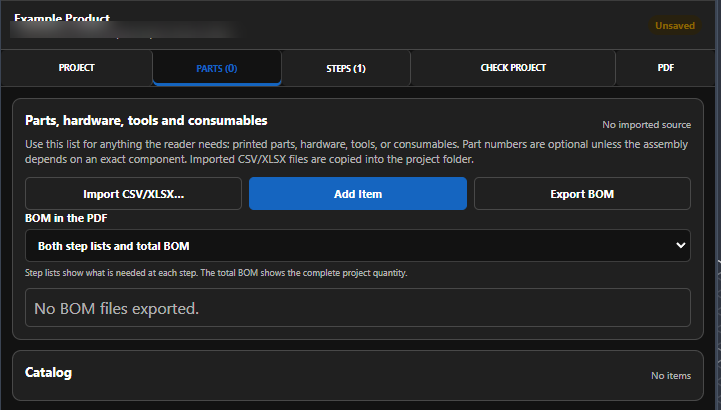
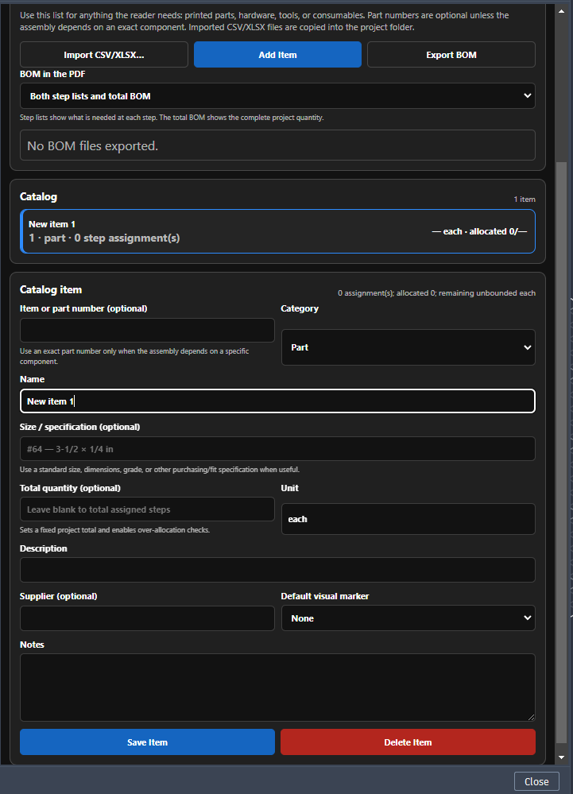
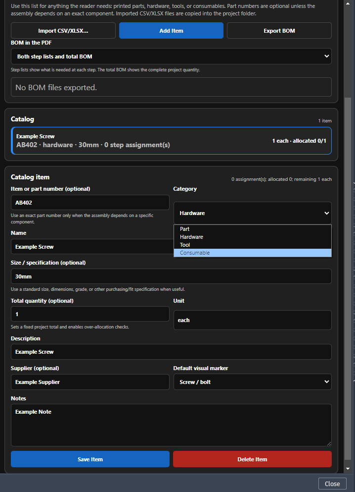
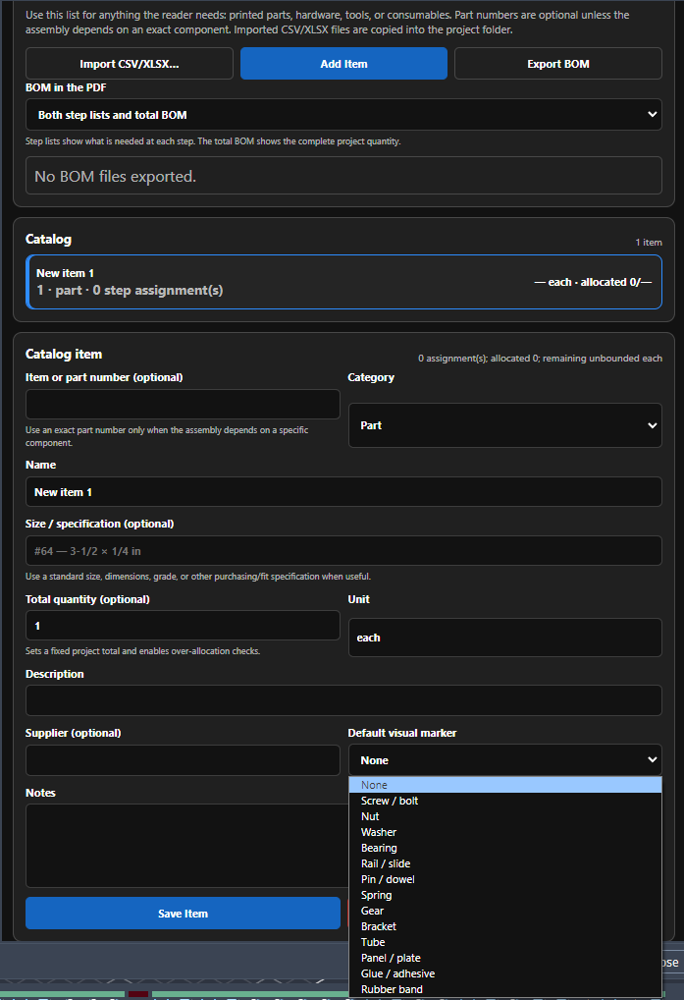
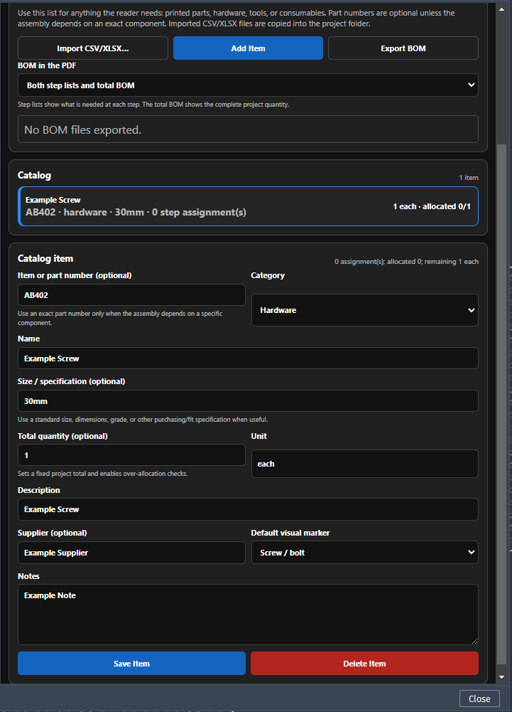
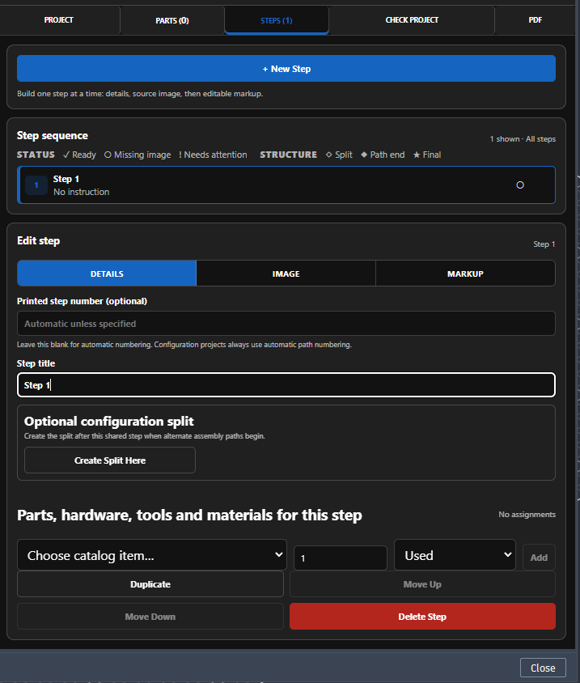
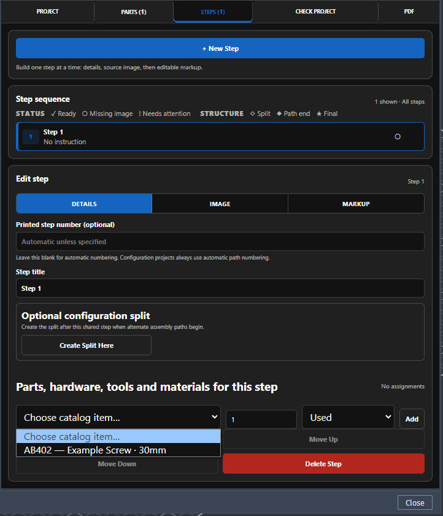
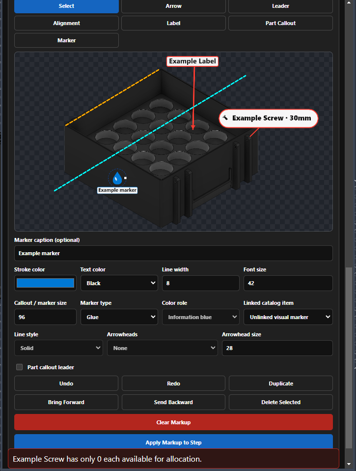

SAGA — Shawn's Assembly Guide Authoring — is an Autodesk Fusion add-in for creating illustrated assembly guides from the model and view already open in Fusion. SAGA 1.0 is currently in Autodesk Design and Make Marketplace review and release qualification. Projects remain editable in normal local folders, and SAGA creates one complete PDF in the project folder when the guide is ready.

For a shorter first-use walkthrough, start with the [Quick Start](quick-start.md). Use [Troubleshooting](troubleshooting.md) when something appears broken, access is not recognized, or publication fails.

<div class="page-toc">
<strong>In this guide</strong>
<ul>
  <li><a href="#access-installation-and-startup">Access, installation, and startup</a></li>
  <li><a href="#projects-and-local-storage">Projects and local storage</a></li>
  <li><a href="#project-settings">Project settings</a></li>
  <li><a href="#parts-hardware-tools-and-consumables">Parts, hardware, tools, and consumables</a></li>
  <li><a href="#steps-captures-and-markup">Steps, captures, and markup</a></li>
  <li><a href="#configuration-paths">Configuration paths</a></li>
  <li><a href="#check-project">Check Project</a></li>
  <li><a href="#create-the-pdf">Create the PDF</a></li>
  <li><a href="#marketplace-access">Marketplace access</a></li>
  <li><a href="#logs-help-and-support">Logs, help, and support</a></li>
</ul>
</div>

## Access, installation, and startup

SAGA is a Windows add-in for Autodesk Fusion. Close Fusion before installing, updating, or removing it.

### Start SAGA in Fusion

1. Open Fusion and go to **Utilities > Scripts and Add-Ins**.
2. Open the **Add-Ins** list and find **SAGA**.
3. Turn **Run** on to start SAGA for the current Fusion session.
4. If you want Fusion to start SAGA automatically later, enable **Run on Startup**.

<figure class="guide-shot guide-shot--wide">
  
  <figcaption>Start SAGA from Fusion's Scripts and Add-Ins window.</figcaption>
</figure>

Once the add-in is running, you do not need to return to Scripts and Add-Ins just to reopen the SAGA palette. Use Fusion's **Add-Ins** menu instead.

<figure class="guide-shot guide-shot--compact">
  
  <figcaption>Open the Add-Ins menu from the Fusion toolbar.</figcaption>
</figure>

<figure class="guide-shot guide-shot--compact">
  
  <figcaption>Select SAGA to open or reopen its palette.</figcaption>
</figure>

SAGA checks Marketplace access for the Autodesk account signed into Fusion. If access is not recognized, see [Marketplace access](#marketplace-access).

**Help:** use **Help** in the SAGA palette, or press **F1** while the SAGA palette has keyboard focus.

## Projects and local storage

A SAGA project stays in a normal local folder on your computer. That folder keeps the editable guide and its related files together, including captures, markup, imported BOM files, cover assets, and generated PDFs.

Keep the complete SAGA project folder together when you move, back up, or archive a guide. Do not rename individual files inside the project folder.

SAGA does not upload your Fusion model or guide content to a SAGA-operated server.

### Create a new project

On the **Project** tab:

1. Enter the **Product name**.
2. Enter the **Product revision** and **Manual revision**.
3. Enter the **Manual title** and **Author**.
4. Select **Browse** and choose the parent folder where the SAGA project should be created.
5. Select **New Project**.

<figure class="guide-shot guide-shot--wide">
  
  <figcaption>Complete the project information, choose a location, then select New Project.</figcaption>
</figure>

SAGA creates the project folder and opens **Steps** so you can begin the guide.

**Product revision** tracks the physical design. **Manual revision** tracks the instruction document, so the manual can be revised without changing the product revision.

### Open an existing project

Select **Open** on the Project tab and choose the existing SAGA project folder. You do not need to complete the new-project fields first.

### Save your SAGA project

Use **Save** on the Project tab after meaningful changes and before closing Fusion. A green **Saved** message confirms that the SAGA project was written to disk.

Generating a PDF does not lock the project. You can reopen the SAGA project later, make changes, and generate an updated guide.

## Project settings

### Manual cover

The **Project** tab can include an optional company/project logo and one finished-product image for the manual cover. Select **Choose Logo** or **Choose Cover Image** to add them. SAGA copies both files into the project folder, so the guide does not depend on their original locations.

<figure class="guide-shot guide-shot--wide">
  
  <figcaption>Cover images are optional. Capture settings control new step images.</figcaption>
</figure>

### Capture settings

The demonstrated defaults are **2560 × 1440**, a **100 ms** delay, and **Anti-alias** enabled. Adjust them when a project needs a different capture size or delay.

**Transparent background is off the first time you use SAGA.** Turn it on before the first transparent capture you want to make. After you select it, SAGA remembers that choice for later runs. You can still turn it on or off for an individual capture.

Capture settings affect new or replacement captures only. Changing a setting does not alter an image that has already been captured; recapture that step when you want the new setting applied.

### Capture diagnostics

**Capture diagnostics** is for troubleshooting, not normal authoring. Use it only when captures appear not to be working correctly. It can capture one diagnostic image for inspection or a rapid set of 30 images for repeated-capture testing.

## Parts, hardware, tools, and consumables

The **Parts** tab is SAGA's project catalog and BOM workspace. Add the things a reader needs for the assembly: printed parts, purchased hardware, tools, and consumables such as glue.

You can **Import CSV/XLSX**, **Add Item** manually, or **Export BOM** from the project.

<figure class="guide-shot guide-shot--wide">
  
  <figcaption>The Parts tab starts as an empty catalog. Import a list or add items as you build the guide.</figcaption>
</figure>

### Add an item

1. Select **Add Item**.
2. Choose the **Category**: **Part**, **Hardware**, **Tool**, or **Consumable**.
3. Enter a clear **Name** and **Unit**.
4. Add an item/part number, size or specification, project quantity, description, supplier, or notes when they are useful.
5. Choose a **Default visual marker** when you want SAGA to suggest a symbol for that item in step markup.
6. Select **Save Item**.

<figure class="guide-shot guide-shot--wide">
  
  <figcaption>Only add the detail that helps someone identify, obtain, or use the item.</figcaption>
</figure>

<figure class="guide-shot guide-shot--compact">
  
  <figcaption>Catalog categories are Part, Hardware, Tool, and Consumable.</figcaption>
</figure>

A default visual marker is separate from the category. For example, a Hardware item may use a **Screw / bolt**, **Nut**, or **Washer** marker; a consumable may use **Glue / adhesive**. The marker can be changed later when you mark up a step.

<figure class="guide-shot guide-shot--compact">
  
  <figcaption>Choose a marker only when it will make the assembly image easier to read.</figcaption>
</figure>

### Quantity and allocation

**Total quantity** is optional. Leave it blank when you do not need a fixed project total. Enter a quantity when SAGA should check how many units are allocated across the guide.

After an item is saved, its catalog card shows the total and current allocation. Step assignments and BOM-aware part callouts update that allocation as the guide is built.

<figure class="guide-shot guide-shot--wide">
  
  <figcaption>A fixed total lets SAGA warn about over-allocation as items are assigned to steps.</figcaption>
</figure>

### Import a BOM

SAGA can import CSV and XLSX files and copies the source file into the SAGA project. The import needs a recognized name column such as `Name`, `Item Name`, or `Part Name`; other supported fields can supply category, quantity, unit, item number, description, supplier, notes, and visual marker.

[Download the SAGA BOM import template](assets/SAGA-BOM-Import-Template.csv).

The **BOM in the PDF** control determines how the BOM is included when the guide is published. You can also use **Export BOM** when you need the project BOM as a separate file.

## Steps, captures, and markup

A normal SAGA step follows the same three-part workflow every time: **Details → Image → Markup**.

### 1. Set up the step

On **Steps**, select **+ New Step**. SAGA creates the step and opens **Details**.

Use **Details** to:

- give the step a short, useful title;
- leave the printed step number blank for automatic numbering unless you need to override it;
- assign the parts, hardware, tools, or consumables needed for this step;
- create a configuration split later when this completed step is where alternate assembly paths begin.

<figure class="guide-shot guide-shot--wide">
  
  <figcaption>Start with the step title and the items needed for this operation.</figcaption>
</figure>

To assign a catalog item, choose it from **Choose catalog item**, set the quantity, choose **Used** or **Introduced** as appropriate, and select **Add**.

<figure class="guide-shot guide-shot--wide">
  
  <figcaption>Items saved on the Parts tab become available for step assignments.</figcaption>
</figure>

### 2. Capture the Fusion view

Open **Image**, then arrange the Fusion viewport exactly as you want the reader to see it. Rotate or zoom the model, change component visibility, highlight or ghost geometry, and prepare the assembly state for that instruction.

Select **Capture View** when the viewport is ready. SAGA captures the current Fusion view and moves you to **Markup**.

If you replace an existing capture, SAGA moves the previous source image to the project's trash. Any markup tied to the old image should be reviewed after recapture.

### 3. Add the instruction and markup

The written **Instruction**, notices, and image markup are added on **Markup**.

Write one clear assembly instruction. Add notices only when they help the reader, and select **Add Notice** for each notice you want to keep.

SAGA places notices automatically:

- **Above the instruction:** Do not, Warning, Caution
- **Below the instruction:** Information, Inspect, Check

The markup tools are:

| Tool | Use it for |
|---|---|
| **Select** | Select, move, resize, restyle, duplicate, reorder, or delete existing markup. |
| **Arrow** | Point to a location or show direction. |
| **Leader** | Draw a connector line without an arrowhead. |
| **Alignment** | Add a dashed visual alignment guide between parts or features. |
| **Label** | Place short image-specific text. |
| **Part Callout** | Identify a catalog item and, when needed, connect the callout to the part with a movable leader. |
| **Marker** | Place a visual symbol for a part, process, or non-BOM action such as glue or cutting. |

<figure class="guide-shot guide-shot--wide">
  
  <figcaption>Use only the markup that makes the Fusion capture easier to understand.</figcaption>
</figure>

### Part Callout and BOM quantity

A **Part Callout** can use a catalog item and its default visual marker.

- **Install or use quantity** counts the displayed quantity against the catalog total.
- **Reference only** identifies the item without allocating another unit.

Enable **Part callout leader** when you want the callout bubble connected to a specific location. Without it, the callout remains a standalone bubble.

### Finish the step

When the instruction and image markup are ready, select **Apply Markup to Step**. This applies the current instruction/markup state to the step for publication while keeping the markup editable in the SAGA project.

That completes the normal step workflow. Repeat **Details → Image → Markup → Apply Markup to Step** for each ordinary or configuration-path step.

### Leaving Markup with unapplied changes

If you leave **Markup** before applying your current work, SAGA asks what to do:

| Choice | Result |
|---|---|
| **Apply and Continue** | Applies the current instruction/markup and continues to the destination you selected. |
| **Discard Changes** | Discards the unapplied instruction/markup state. The active step image can also be moved to project trash, so you may need to recapture before Markup can continue. |
| **Cancel** | Stays in Markup without applying or discarding the work. |

If Discard leaves the step without an active image, return to **Image**, arrange the Fusion viewport, capture the step again, then continue in **Markup**. See [After Discard Changes, the step image appears broken](troubleshooting.md#after-discard-changes-the-step-image-appears-broken).

## Configuration paths

Configurations are optional. Use them when the guide has a shared opening sequence followed by alternate assembly choices and, optionally, a shared finish.

SAGA 1.0 supports:

- One configuration split
- Up to five paths from that split
- No nested configuration splits

To create a split:

1. Select the last shared step before the alternatives begin.
2. Choose **Create Split Here**.
3. Name the first two paths.
4. Add more paths when needed, up to the supported total of five.
5. Select the appropriate path while creating its branch steps.

SAGA calculates path-specific printed step numbers and adds PDF navigation so readers can move from the shared sequence to the correct branch. Keep shared finishing steps outside the alternate branch where the project structure calls for a common finish.

## Check Project

Open **Check Project** before publication.

- **Errors** must be corrected before PDF generation.
- **Warnings** should be reviewed but do not block publication.

Checks cover documented publication-readiness areas including required project information, step images and instructions, configuration consistency, BOM allocation, assets, and publication readiness. A step-related result opens the affected step.

Run the check again after correcting an error. Do not treat a warning as an error when the reported condition is intentional, but review it before publication.

See [The project check reports an error](troubleshooting.md#the-project-check-reports-an-error) if a result is unclear or publication remains blocked.

## Create the PDF

On **PDF**, choose the publication options and then select **Generate PDF**.

| PDF control | Purpose |
|---|---|
| Page size | Chooses the page dimensions for the generated guide. |
| Orientation | Chooses the page orientation. |
| Cover page | Includes or omits the project cover. |
| Contents and links | Includes or omits the linked contents/navigation supported by the project. |
| Bill of materials | Includes or omits the total BOM in the publication. |
| **Generate PDF** | Compiles the current checked project into one PDF in the project folder. |

The generated PDF may contain the cover, linked contents, bookmarks, configuration links, step notices, marked-up images, step-specific item lists, and total BOM, according to the project and selected publication options.

Correct all **Check Project** errors before generating the PDF. Large projects and high-resolution images may take longer to compile. If Windows reports that the output is in use, close the existing PDF in its viewer and generate it again.

The demonstration guide and Marketplace screenshots are submission materials. Public downloads are planned after Marketplace review is complete.

## Marketplace access

SAGA is submitted to the Autodesk Design and Make Marketplace as a paid, one-time-purchase application with the Marketplace **Free 30-Day Trial** option enabled.

The trial uses the same documented authoring and publication features as purchased access:

- Trial output is not watermarked.
- Customer logo and cover-image branding remain enabled.
- SAGA does not run a separate local trial clock.

SAGA asks Autodesk's Marketplace entitlement service whether the Autodesk account signed into Fusion currently has valid access. The entitlement response tells SAGA whether access is valid; it does not identify the valid access as specifically a trial or purchase. SAGA therefore reports an access state rather than maintaining its own independent trial status.

### Access states

| State or control | Meaning |
|---|---|
| **Access active** | Autodesk currently reports valid Marketplace access for the signed-in account. |
| **Access required** | Autodesk does not currently report valid Marketplace access for the signed-in account. |
| **Check again** | Requests another Autodesk Marketplace access check. |

When the palette shows **Access required**:

1. Confirm that Fusion is signed in with the Autodesk account used for the trial or purchase.
2. If needed, start the Marketplace Free 30-Day Trial or purchase SAGA using that same account.
3. Return to SAGA and select **Check again**.

### Temporary Autodesk-service or network failure

After a successful Autodesk access result, SAGA may use that prior successful result for up to 24 hours if Autodesk's entitlement service is temporarily unavailable. **The 24-hour period is SAGA-specific cache behavior; Autodesk does not require that duration.**

A completed negative response from Autodesk takes effect immediately and is not overridden by the earlier successful result. The cached result does not reset, extend, pause, or create a Marketplace trial.

Do not delete SAGA's local entitlement data unless support asks you to do so. Removing it requires online re-verification and does not reset, extend, or cancel a trial or purchase held by Autodesk.

### When Marketplace access ends

When Autodesk no longer reports valid access, SAGA authoring and PDF publication remain unavailable until valid Marketplace access is reported again.

Access ending does **not** delete or alter:

- Existing SAGA project folders
- Existing project content
- Previously generated PDFs

If access should still be active, follow [A trial or purchase is not recognized](troubleshooting.md#a-trial-or-purchase-is-not-recognized).

## Logs, help, and support

Select **Help** in the palette or press **F1 while the SAGA palette has keyboard focus**. Fusion routes F1 to the active pane, so SAGA help does not open while the Fusion canvas has focus.

SAGA writes local diagnostic logs under:

```text
%LOCALAPPDATA%\SAGA\logs
```

When requesting support, include:

- SAGA version
- Fusion version
- Windows version
- The exact error message, when one appears
- Steps that reproduce the issue
- A screenshot or local SAGA log when useful

Remove confidential project information before sending logs or screenshots unless it is necessary to diagnose the issue.

Support: **sagaappsupport@gmail.com**

See the [Support Policy](support.md), [Privacy Policy](privacy.md), [Licensing](licensing.md), and [Troubleshooting](troubleshooting.md) pages for support scope, data handling, access terms, and recovery guidance.